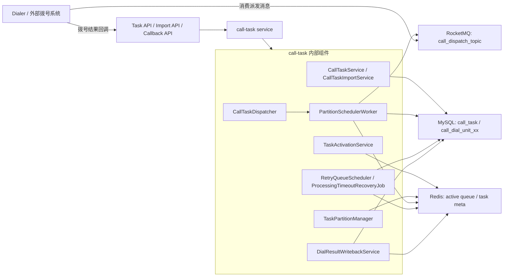
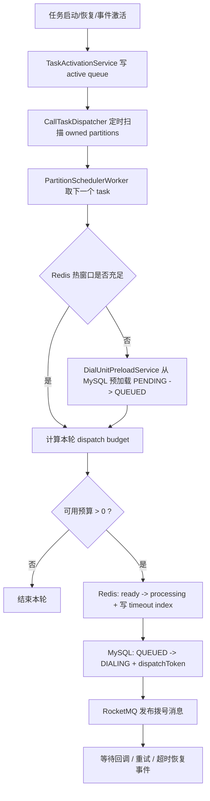
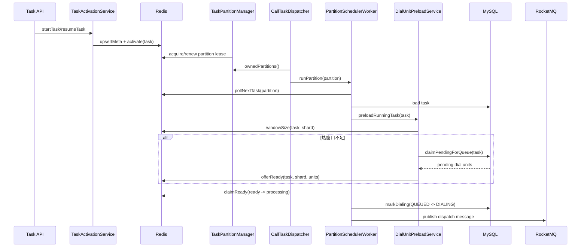
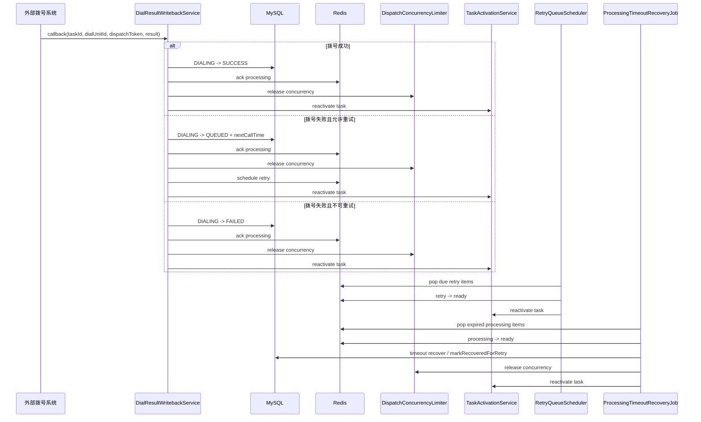

# Call Task 号码调度总体架构

**文档日期：** 2026-05-28  
**适用范围：** `call-task` 模块当前已落地的号码调度链路  
**目标读者：** 架构设计、后端开发、运维排障

> 2026-05-28 更新：
> 已完成活跃任务队列真实消费、`fairScore` 重排、主派发链路并发占用/回滚、运行中任务导入后自动激活。

## 1. 文档目标

本文聚焦 `call-task` 中“号码如何被调度出去”的完整链路，覆盖以下问题：

- 任务从创建、启动到进入调度的入口是什么
- 号码从 MySQL 进入 Redis 热窗口的机制是什么
- 多实例下如何避免重复调度
- 并发、重试、超时恢复、结果回写如何形成闭环
- 当前实现的优点、缺点和已知边界是什么

本文基于当前仓库代码分析，不只描述目标设计，也描述当前真实实现。

## 2. 范围与结论

### 2.1 覆盖范围

本次分析覆盖以下核心类：

- `CallTaskService`
- `CallTaskImportService`
- `TaskActivationService`
- `TaskPartitionManager`
- `CallTaskDispatcher`
- `PartitionSchedulerWorker`
- `DialUnitPreloadService`
- `RedisDialUnitQueue`
- `CallDialUnitRepository`
- `DialResultWritebackService`
- `RetryQueueScheduler`
- `ProcessingTimeoutRecoveryJob`
- `DispatchConcurrencyLimiter`

### 2.2 总体结论

当前号码调度架构采用 `MySQL + Redis + RocketMQ` 的分层方案：

- `MySQL` 保存任务与号码真实状态，是最终真相
- `Redis` 保存活跃任务、热号码窗口、重试到期索引、处理超时索引，是高频调度面
- `RocketMQ` 承担实际拨号投递
- `call-task` 内部通过“分区租约 + 活跃任务队列 + 事件回写再激活”组织整个闭环

这个设计方向已经在代码里形成闭环，当前已具备：

- `ActiveTaskQueue` 真实 `poll / block / reactivate`
- `fairScore` 基于实际派发量增长
- 主派发链路的批量并发占用与回滚
- 运行中任务导入后的自动重新激活

因此，当前架构已经从“骨架阶段”进入“关键控制点收口完成”的阶段，剩余问题主要集中在任务自动完结、环境依赖测试和更细粒度的调度策略优化。

## 3. 设计思想

### 3.1 MySQL 作为最终真相，Redis 作为热调度面

设计的核心不是把全量号码放进 Redis，而是只把当前值得被调度的一小段热窗口放进去：

- 全量号码保存在 `call_dial_unit_xx`
- 调度前通过预加载把 `PENDING` 号码搬成 `QUEUED` 并放入 Redis `ready` 队列
- 拨号中号码进入 `processing`
- 待重试号码进入 `retry`

这样做的目的：

- 避免 Redis 承载全量名单
- 保证 Redis 丢失后仍能从 MySQL 恢复
- 兼顾吞吐和可恢复性

### 3.2 容量驱动，而不是时间轮询驱动

旧思路依赖 `next_dispatch_time`，本质上是“按时间扫任务”。当前新架构的目标是“按容量继续下发”：

- 只要任务还有号码
- 只要任务并发没满
- 只要被相关事件重新激活

就应立即继续调度，而不是等待下一次全量扫描。

这也是为什么当前设计里：

- 任务级 `next_dispatch_time` 已被废弃
- 活跃任务队列成为调度入口
- 回写、重试、恢复都会反向激活任务

### 3.3 多实例下按分区拆分责任

系统不让所有实例都扫所有任务，而是先把任务按 `taskId` 哈希进固定分区，再让实例通过 Redis lease 抢分区：

- 一个分区同一时刻只允许一个实例持有
- 一个任务只由所属分区 owner 调度
- 实例宕机后 lease 超时，其他实例可接管

这样做解决的是“规模上来后每个实例重复扫描全量任务”的问题。

### 3.4 状态迁移依赖 Redis 原子脚本 + MySQL 条件更新

调度类系统最怕重复拨打、重复回收、并发计数失真。当前架构用两种机制兜底：

- Redis 侧用 Lua 脚本做队列迁移，保证 `ready -> processing`、到期回搬等动作原子执行
- MySQL 侧用 `status + dispatch_token` 等条件更新，保证状态机幂等推进

这意味着 Redis 是高频操作面，但最终是否算“成功迁移”，还是以 MySQL 更新结果为准。

### 3.5 事件驱动闭环，而不是单向派发

调度不是“发出去就结束”，而是闭环：

- 派发成功后等待回调
- 回调成功则完成
- 回调失败则根据重试策略进入 retry
- 回调超时则由恢复任务托底
- 任何导致“又有号码可拨”的事件，都重新激活任务

因此真正的调度入口不只有启动任务，还包括：

- 启动/恢复任务
- 重试到期
- 超时恢复
- 拨号结果回写

## 4. 核心组件与职责

| 组件 | 职责 | 关键说明 |
| --- | --- | --- |
| `CallTaskService` | 任务创建、启动、暂停、恢复 | `RUNNING` 时触发任务激活 |
| `CallTaskImportService` | 导入号码到 MySQL | 只写库，不直接灌满 Redis |
| `TaskActivationService` | 把任务放入活跃调度队列 | 调度入口统一收口，作为 import/callback/retry/recovery 的再激活入口 |
| `TaskPartitionManager` | 分区 lease 抢占与续租 | 多实例分工基础 |
| `CallTaskDispatcher` | 周期性调度本实例持有分区 | 调度主循环入口 |
| `PartitionSchedulerWorker` | 单分区执行派发 | 预加载、预算计算、claim、DB 更新、MQ 发送 |
| `DialUnitPreloadService` | 从 MySQL 预热号码到 Redis | Redis 热窗口补货 |
| `RedisDialUnitQueue` | 管理 ready/processing/retry 与 due index | 高频队列状态机 |
| `CallDialUnitRepository` | 号码状态真实迁移 | CAS 语义落在这里 |
| `DialResultWritebackService` | 处理拨号成功/失败回写 | 释放并发、安排重试、再激活 |
| `RetryQueueScheduler` | 处理 retry 到期 | retry -> ready |
| `ProcessingTimeoutRecoveryJob` | 处理 processing 超时 | 托底回收 |
| `DispatchConcurrencyLimiter` | 维护全局/租户/任务并发额度 | 已支持批量占用和批量回滚，主派发链路已接入 |

## 5. 数据与状态模型

### 5.1 任务状态

`call_task.status` 当前包含：

- `INIT`
- `RUNNING`
- `PAUSED`
- `FINISHED`

其中真正进入调度的是 `RUNNING`。

### 5.2 号码状态

`call_dial_unit_xx.status` 当前包含：

- `PENDING`
- `QUEUED`
- `DIALING`
- `SUCCESS`
- `FAILED`

语义如下：

- `PENDING`：只在 MySQL，尚未进入 Redis 热窗口
- `QUEUED`：已进入待派发状态
- `DIALING`：已投递到拨号链路，等待回调
- `SUCCESS`：拨号成功结束
- `FAILED`：不可再重试或最终失败

### 5.3 Redis 状态面

当前关键 Redis 结构如下：

- `call:scheduler:partition:{p}:owner`
  - 分区 owner lease
- `call:scheduler:partition:{p}:active`
  - 分区活跃任务队列，ZSET
- `call:scheduler:task:{taskId}:meta`
  - 任务调度元数据，HASH
- `queue:ready:{taskId}:{shard}`
  - 待派发号码队列，ZSET
- `queue:processing:{taskId}:{shard}`
  - 处理中号码队列，ZSET
- `queue:retry:{taskId}:{shard}`
  - 待重试号码队列，ZSET
- `queue:retry-due:{partition}`
  - 分区级 retry 到期索引
- `queue:processing-timeout:{partition}`
  - 分区级 processing 超时索引

## 6. 总体架构图

## 7. 主调度流程

### 7.1 流程说明

主链路可以拆成 8 步：

1. 任务启动或恢复时，`TaskActivationService` 把任务放入所属 partition 的活跃队列。
2. `TaskPartitionManager` 负责让当前实例持有若干 partition。
3. `CallTaskDispatcher` 定时遍历本实例持有的 partition。
4. `PartitionSchedulerWorker` 从该 partition 的活跃任务队列中取一个任务。
5. `DialUnitPreloadService` 检查 Redis 热窗口，不足则从 MySQL 把 `PENDING` 号码预热成 `QUEUED`。
6. `RedisDialUnitQueue` 原子把号码从 `ready` claim 到 `processing`，并写入超时索引。
7. `CallDialUnitRepository` 把号码真实状态从 `QUEUED` 更新成 `DIALING`，写入 `dispatchToken` 和 `inflightExpireAt`。
8. `DialDispatchPublisher` 把拨号消息发到 RocketMQ，进入外部拨号链路。

### 7.2 主调度流程图

## 8. 时序图

### 8.1 主派发时序图

### 8.2 回写 / 重试 / 恢复时序图

## 9. 关键机制拆解

### 9.1 任务激活机制

当前系统不是扫描所有 `RUNNING` 任务，而是尽量只处理“被激活”的任务。

激活来源包括：

- `startTask`
- `resumeTask`
- 拨号结果回写
- retry 到期
- processing 超时恢复

优点是把“谁值得下一轮被调度”显式化了，避免全表扫描。

### 9.2 预加载机制

预加载是当前架构很关键的一层缓冲：

- Redis 热窗口不够时，才从 MySQL 批量提取
- 提取顺序按 `next_call_time`、`id` 排序
- 提取后 MySQL 中号码从 `PENDING` 改成 `QUEUED`
- Redis `ready` 分数由 `nextCallTime + score` 组成

这保证：

- 未启动任务不会占 Redis
- 活跃任务能持续获得补货
- Redis 容量和数据恢复风险可控

### 9.3 分区租约机制

`TaskPartitionManager` 通过 Redis key 做 lease：

- 空闲分区用 `SET NX PX` 抢占
- 已持有分区周期性续租
- 续租失败即失去该分区所有权

优点：

- 天然支持水平扩容
- 实例故障可被动转移
- 无需额外协调器

### 9.4 号码状态机机制

当前真实状态推进发生在 MySQL 中：

- `PENDING -> QUEUED`
- `QUEUED -> DIALING`
- `DIALING -> SUCCESS`
- `DIALING -> QUEUED`
- `DIALING -> FAILED`

其中 `dispatchToken` 的作用很关键：

- 一次派发分配一个 token
- 回写时要求 token 一致
- 能把旧回调、重复回调、超时恢复与最新派发区分开

### 9.5 重试与超时恢复机制

系统没有依赖“扫所有任务”的方式做重试，而是做了 partition 级 due index：

- retry 到期索引：`queue:retry-due:{partition}`
- processing 超时索引：`queue:processing-timeout:{partition}`

这让后台任务只处理“当前到期项”，而不是“所有运行中任务”。

## 10. 当前实现的优点

### 10.1 架构方向正确

从设计方向上看，当前实现已经避开了最重的反模式：

- 没有把全量号码池塞进 Redis
- 没有让所有实例扫描所有任务
- 没有把调度真相只放在缓存里
- 没有让失败恢复依赖人工补偿

### 10.2 组件边界清晰

任务管理、号码导入、调度器、回写器、重试器、恢复器的职责已经拆开，后续优化可以局部演进，不需要整体推翻。

### 10.3 可恢复性好

即使 Redis 临时异常，MySQL 中仍有完整状态；即使实例宕机，分区 lease 过期后也可以转移；即使回调丢失，processing 超时恢复也能托底。

### 10.4 可扩展性好

分区模型和 Redis 热窗口模型具备天然的水平扩展能力，后续增加实例数比“全量轮询”架构更线性。

### 10.5 对业务语义友好

任务优先级、号码重试、调度超时、回写幂等等业务语义都已经在模型层面被表达出来，不是散落在脚本或临时代码里。

## 11. 当前剩余风险

### 11.1 回写成功时的任务再激活偏保守但有额外噪声

当前成功回写、失败回写、retry 到期、超时恢复后都会激活任务。好处是可以尽快补位，坏处是：

- 激活可能比较频繁
- 当任务 ready 窗口很浅时，可能出现较多“空唤醒”

### 11.2 任务完成态还没有完全闭环

当前代码已经支持 `FINISHED` 状态枚举，但在调度域里还缺少完整的“自动完结”条件，例如：

- Redis 无号码
- MySQL 无 `PENDING/QUEUED/DIALING`
- 无待重试项

这部分仍需后续补齐。

### 11.3 环境依赖型测试不能在当前沙箱完全跑通

当前离线环境下：

- 聚焦单元测试和轻量 Spring 测试可以跑通
- `CallTaskApplicationTest` 依赖 MySQL
- 部分测试会探测 Docker / Testcontainers 环境

因此“全模块全环境测试通过”仍依赖本地基础设施。

## 12. 总体优缺点总结

### 12.1 优点

- 架构分层清晰，职责明确
- MySQL 与 Redis 的职责划分合理
- 支持多实例扩展和故障转移
- 已具备回写、重试、超时恢复闭环
- 已为公平调度和事件驱动调度预留好结构

### 12.2 缺点

- 回调驱动的再激活仍可能偏频繁
- 任务自动完成收敛逻辑还不完整
- 全量环境测试依赖本地 MySQL 和 Docker

## 13. 演进建议

建议按以下优先级补齐：

1. 增加任务自动完结和统计收敛逻辑。
2. 评估是否需要进一步压缩高频 reactivation 带来的空唤醒。
3. 为 `CallTaskApplicationTest` 和基础设施型测试补稳定的本地测试 profile。

## 14. 一句话结论

当前 `call-task` 的号码调度架构已经完成关键控制点收口：`MySQL 保真相、Redis 保热状态、RocketMQ 做投递、分区 lease 做多实例分工、active queue 做真实消费与重排、并发额度做成对占用与释放、回写/重试/恢复/import 都成为可靠再激活事件源`。  
后续最优先的工作已经从“补齐调度闭环”转成“完善任务完成收敛和环境测试覆盖”。
