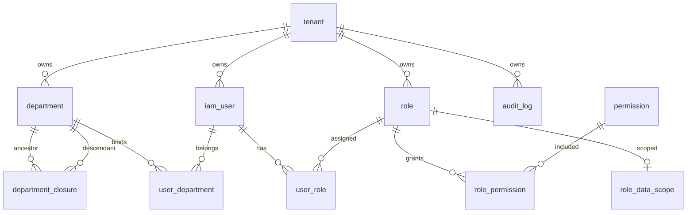

# IAM User Center Design

**日期：** 2026-06-04  
**状态：** 已确认，待实现

## 1. 背景

当前仓库已经具备多模块 Maven 后端骨架，包含：

- `call-common`
- `call-ingestion`
- `call-search`
- `call-ops`
- `call-task`

但尚未提供统一身份认证与授权中心，缺少：

- 平台级租户生命周期管理
- 多租户用户中心
- 组织架构管理
- 角色与权限管理
- 数据权限控制
- 审计日志中心

本设计新增：

- 后端模块：`call-iam`
- 前端工程：`call-iam-web`

用于承载 AI Outbound SaaS Platform 的统一 IAM User Center。

## 2. 目标与非目标

### 2.1 目标

- 提供统一登录认证中心，支持 `username / mobile / email + password`
- 提供统一授权中心，支持 `RBAC + ABAC + 数据权限`
- 提供平台级租户管理能力
- 提供租户内组织、用户、角色、权限管理能力
- 提供完整审计能力，覆盖登录、登出、账号管理、角色授权、导出等关键动作
- 在当前仓库内以生产可运行的单体服务形式落地

### 2.2 非目标

IAM User Center 不负责：

- 任务管理
- AI Agent 管理
- Caller ID 资产管理
- CRM
- Billing

这些系统通过 `tenant_id` 和 `user_id` 与 IAM 关联。

## 3. 已确认决策

- 新增独立后端模块 `call-iam`
- 新增独立前端工程 `call-iam-web`
- 部署形态采用单体服务
- 多租户隔离采用共享库共享表模式
- 所有租户内主数据表强制带 `tenant_id`
- 存在平台级超级管理员
- 登录支持 `username / mobile / email`
- 前端交付为可运行管理后台
- 技术栈采用 `JDK 21 / Spring Boot / Spring Security / MyBatis Plus / MySQL 8 / Redis 7 / RocketMQ 5 / JWT / Maven / Vue3 + Element Plus`

## 4. 总体架构

采用 `模块化单体 + DDD + Clean Architecture + Hexagonal Architecture`。

部署单元上，`call-iam` 是单个 Spring Boot 服务；在服务内部按领域切分为若干子域，并通过端口-适配器模式隔离领域模型与技术细节。

### 4.1 分层结构

- `interfaces`
  - REST Controller
  - OpenAPI
  - 请求/响应 DTO
  - 全局异常处理
- `application`
  - Use Case
  - Command / Query
  - Assembler
  - 事务边界
- `domain`
  - Aggregate
  - Value Object
  - Domain Service
  - Domain Event
  - Repository Port
- `infrastructure`
  - MyBatis Plus Mapper
  - Redis Token Store
  - RocketMQ Event Publisher
  - JWT Provider
  - Spring Security Adapter

### 4.2 子域划分

- `platform-tenant`
  - 平台级租户管理
  - 租户状态机
- `identity`
  - 登录、登出、刷新令牌
  - 密码策略
  - 账号锁定
- `organization`
  - 部门树管理
  - Closure Table 维护
- `authorization`
  - 角色、权限、数据权限
  - RBAC 与 ABAC 决策
- `audit`
  - 审计事件记录
  - 审计查询

## 5. 运行链路

### 5.1 认证链路

1. 客户端请求 `POST /api/iam/auth/login`
2. `LoginUseCase` 解析登录标识类型
3. 加载用户、租户、角色、部门摘要
4. 校验：
   - 用户存在
   - 用户状态可登录
   - 租户状态为 `ACTIVE`
   - 密码匹配
5. 签发：
   - `AccessToken`，有效期 30 分钟
   - `RefreshToken`，有效期 7 天
6. `RefreshToken` 以哈希形式存 Redis
7. 写入审计事件并返回用户资料摘要

### 5.2 授权链路

1. 请求进入 `JwtAuthenticationFilter`
2. 解析 JWT Claim：
   - `tenantId`
   - `userId`
   - `roleIds`
   - `deptIds`
3. `Spring Security` 进行接口级权限控制
4. 应用层通过 `AuthorizationPolicyService` 和 `DataScopeResolver` 生成数据范围
5. MyBatis Plus 层统一注入 `tenant_id`
6. 业务查询自动追加部门或本人过滤条件

### 5.3 审计链路

1. 敏感操作在应用层形成审计命令
2. 事务提交后发布审计事件
3. 审计事件异步投递到 RocketMQ
4. 审计消费者持久化 `audit_log`
5. 登录、登出允许同步简版审计 + 异步扩展详情

## 6. 领域模型

### 6.1 Tenant 聚合

- 聚合根：`Tenant`
- 核心属性：
  - `id`
  - `tenantCode`
  - `tenantName`
  - `status`
  - `packageId`
  - `expireTime`
  - `quota`
- 规则：
  - `ACTIVE -> SUSPENDED / EXPIRED / DELETED`
  - `SUSPENDED -> ACTIVE`
  - 禁止 `DELETED -> ACTIVE`
  - 非 `ACTIVE` 租户不可登录

### 6.2 Department 聚合

- 聚合根：`Department`
- 核心属性：
  - `id`
  - `tenantId`
  - `parentId`
  - `name`
  - `status`
  - `sort`
- 规则：
  - 不允许跨租户移动
  - 不允许移动到自身子树
  - 名称在同一租户同一父节点下唯一
- `department_closure` 为基础设施实现细节，不直接暴露为聚合

### 6.3 User 聚合

- 聚合根：`User`
- 核心属性：
  - `id`
  - `tenantId`
  - `userType`
  - `username`
  - `mobile`
  - `email`
  - `passwordHash`
  - `nickname`
  - `avatar`
  - `status`
  - `lastLoginTime`
- 规则：
  - 密码使用 BCrypt
  - 长度至少 8 位
  - 必须包含数字、小写字母、大写字母
  - 状态包含 `ENABLE / DISABLE / LOCK`
  - 平台用户可无 `tenantId`
  - 租户用户必须有 `tenantId`

### 6.4 Role 聚合

- 聚合根：`Role`
- 角色类型：
  - `PLATFORM_SYSTEM`
  - `TENANT_SYSTEM`
  - `TENANT_CUSTOM`
- 默认角色：
  - `TENANT_ADMIN`
  - `SUPERVISOR`
  - `OPERATOR`
  - `QA`
  - `VIEWER`
- 规则：
  - 内置系统角色不可被普通管理员删除
  - 数据权限挂在角色上而不是用户上

### 6.5 Permission 聚合

- 聚合根：`Permission`
- 权限码格式：`resource:action`
- 典型权限：
  - `tenant:create`
  - `tenant:update`
  - `user:create`
  - `user:update`
  - `audit:view`

### 6.6 AuditLog 聚合

- 聚合根：`AuditLog`
- 用途：记录操作事实
- 特征：
  - append-only
  - 只允许脱敏补全，不允许业务语义修改

### 6.7 领域服务

- `PasswordPolicyService`
- `AuthorizationPolicyService`
- `DataScopeResolver`
- `DepartmentTreeDomainService`
- `TenantAccessPolicy`

### 6.8 领域事件

- `UserLoggedIn`
- `UserLoginFailed`
- `UserCreated`
- `UserDeleted`
- `RolePermissionsChanged`
- `TenantStatusChanged`

## 7. 授权模型

### 7.1 RBAC

关系模型：

- `User -> Role`
- `Role -> Permission`

能力要求：

- 支持多角色
- 支持动态授权
- 支持实时生效

实时生效策略：

- 接口权限以 JWT 中角色摘要快速判定
- 角色与权限变更后，通过版本号或 Redis 缓存驱逐使刷新令牌后的会话立即生效
- 对敏感操作可增加服务端二次权限校验，避免纯 token 快照过期

### 7.2 ABAC

在 RBAC 基础上叠加属性判断，支持：

- `resource.ownerId`
- `resource.creatorId`
- `departmentId`
- `tenantId`

示例策略：

```text
task.pause
allow when task.creatorId == user.id
```

ABAC 评估放在应用层策略组件中完成，不直接写在 Controller。

### 7.3 数据权限

支持：

- `ALL`
- `DEPARTMENT`
- `DEPARTMENT_AND_CHILD`
- `SELF`
- `CUSTOM`

实现原则：

- 数据范围定义在角色上
- 用户拥有多个角色时取并集
- 查询时通过 `DataScopeResolver` 解析为：
  - 可访问部门集合
  - 是否允许访问本人数据

典型查询注入：

```sql
department_id in (...)
```

## 8. 多租户隔离

采用共享库共享表模式。

约束如下：

- 所有租户内主表均带 `tenant_id`
- 平台管理员数据可通过 `tenant_id is null` 或 `user_type = PLATFORM` 区分
- 所有业务查询默认自动拼接 `tenant_id`
- 任何写操作必须在应用层和基础设施层双重校验租户边界

实现方式：

- `TenantContext` 从 JWT 中提取当前租户上下文
- 自定义 MyBatis Plus 拦截器自动补充 `tenant_id`
- 平台接口仅对平台管理员放开，并绕过租户数据隔离的自动条件注入

## 9. 数据库设计

### 9.1 核心表

- `tenant`
- `department`
- `department_closure`
- `iam_user`
- `role`
- `permission`
- `user_role`
- `role_permission`
- `user_department`
- `role_data_scope`
- `audit_log`

### 9.2 ER 图



### 9.3 索引设计

唯一索引：

- `tenant.uk_tenant_code`
- `iam_user.uk_tenant_username`
- `iam_user.uk_tenant_mobile`
- `iam_user.uk_tenant_email`
- `role.uk_tenant_role_code`
- `permission.uk_permission_code`
- `department.uk_tenant_parent_name`
- `department_closure.uk_ancestor_descendant`
- `user_role.uk_user_role`
- `role_permission.uk_role_permission`
- `user_department.uk_user_department`

查询索引：

- `tenant.idx_status_expire_time`
- `department.idx_tenant_parent_id`
- `department.idx_tenant_status`
- `department_closure.idx_tenant_ancestor_depth`
- `department_closure.idx_tenant_descendant_depth`
- `iam_user.idx_tenant_status`
- `iam_user.idx_tenant_last_login_time`
- `iam_user.idx_user_type`
- `role.idx_tenant_role_type`
- `audit_log.idx_tenant_created_at`
- `audit_log.idx_operator_created_at`
- `audit_log.idx_resource_type_resource_id`

### 9.4 分区策略

只有 `audit_log` 做分区。

建议：

- 按月 `RANGE` 分区
- 分区键：`created_at`
- 保留在线数据 12 到 24 个月
- 历史分区归档到冷存储

其余主数据表首版不分区，以控制复杂度。

## 10. 组织架构实现

部门树采用 `Closure Table`。

满足目标：

- 支持 10000 部门
- 支持无限层级
- 支持树查询
- 支持批量移动

实现原则：

- `department` 保存节点本体
- `department_closure` 保存祖先-后代传递关系
- 新增节点时写入自反关系和所有祖先关系
- 移动子树时删除旧路径，再批量生成新路径
- 查整棵子树时直接通过 closure 表查询，不使用递归 SQL

## 11. 认证设计

采用 `JWT + Refresh Token`。

### 11.1 Token 生命周期

- `AccessToken`：30 分钟
- `RefreshToken`：7 天

### 11.2 JWT Claim

```json
{
  "tenantId": 1001,
  "userId": 2001,
  "roleIds": [1, 2],
  "deptIds": [10, 11]
}
```

补充建议字段：

- `userType`
- `tenantStatus`
- `tokenVersion`

### 11.3 刷新策略

- Refresh token 只在 Redis 中以哈希形式存储
- 刷新时执行轮换，旧 refresh token 立即失效
- 登出时删除对应 refresh token 记录
- 用户锁定、角色变更、租户冻结时支持批量踢出会话

### 11.4 安全控制

- JWT 使用服务端私钥或高强度 HMAC 密钥签名
- 密码哈希采用 BCrypt
- 登录失败次数写 Redis，触发短期锁定
- 登录接口限流
- 输入参数统一校验，防止 SQL 注入
- 响应内容脱敏，降低 XSS 风险

## 12. OpenAPI 设计

统一前缀：`/api/iam`

### 12.1 Auth API

- `POST /api/iam/auth/login`
- `POST /api/iam/auth/logout`
- `POST /api/iam/auth/refresh`
- `GET /api/iam/auth/me`

### 12.2 Tenant API

- `POST /api/iam/tenants`
- `GET /api/iam/tenants`
- `GET /api/iam/tenants/{id}`
- `PUT /api/iam/tenants/{id}`
- `DELETE /api/iam/tenants/{id}`
- `PUT /api/iam/tenants/{id}/status`

### 12.3 User API

- `POST /api/iam/users`
- `GET /api/iam/users`
- `GET /api/iam/users/{id}`
- `PUT /api/iam/users/{id}`
- `DELETE /api/iam/users/{id}`
- `PUT /api/iam/users/{id}/status`
- `PUT /api/iam/users/{id}/password/reset`
- `PUT /api/iam/users/{id}/roles`
- `PUT /api/iam/users/{id}/departments`

### 12.4 Role API

- `POST /api/iam/roles`
- `GET /api/iam/roles`
- `GET /api/iam/roles/{id}`
- `PUT /api/iam/roles/{id}`
- `DELETE /api/iam/roles/{id}`
- `PUT /api/iam/roles/{id}/permissions`
- `PUT /api/iam/roles/{id}/data-scope`

### 12.5 Department API

- `POST /api/iam/departments`
- `GET /api/iam/departments/tree`
- `GET /api/iam/departments/{id}`
- `PUT /api/iam/departments/{id}`
- `PUT /api/iam/departments/{id}/move`
- `DELETE /api/iam/departments/{id}`

### 12.6 Permission / Audit API

- `GET /api/iam/permissions`
- `GET /api/iam/audit-logs`
- `GET /api/iam/audit-logs/{id}`

### 12.7 响应模型

统一返回：

```json
{
  "code": "OK",
  "message": "success",
  "data": {},
  "traceId": "..."
}
```

分页返回：

```json
{
  "code": "OK",
  "message": "success",
  "data": {
    "items": [],
    "pageNo": 1,
    "pageSize": 20,
    "total": 100
  },
  "traceId": "..."
}
```

## 13. 前端设计

前端工程 `call-iam-web` 采用：

- `Vue3`
- `Vite`
- `TypeScript`
- `Vue Router`
- `Pinia`
- `Element Plus`

### 13.1 页面范围

- 登录页
- 仪表盘
- 租户管理
- 部门管理
- 用户管理
- 角色权限管理
- 审计日志

### 13.2 权限交互

- 登录后拉取 `me` 接口
- 路由基于权限点或菜单元数据做前端裁剪
- 按钮级能力通过权限指令控制
- Access token 过期后自动用 refresh token 刷新
- 刷新失败则清空会话并跳转登录页

## 14. 非功能设计

### 14.1 性能

目标：

- 1000 租户
- 100000 用户
- 10000 QPS 鉴权
- `P95 < 50ms`

手段：

- JWT 本地校验，降低鉴权链路数据库依赖
- 权限、角色、部门摘要缓存到 Redis
- 读多写少的字典类数据本地缓存
- 审计异步化
- 部门树使用 closure table，避免递归查询

### 14.2 安全

- JWT 签名校验
- BCrypt 密码加密
- 租户隔离自动注入
- 登录接口限流
- SQL 注入防护
- XSS 防护和统一输出转义
- 敏感字段审计脱敏

### 14.3 可运维性

- 暴露健康检查和指标端点
- 记录结构化日志，包含 `traceId`
- 审计失败支持重试和死信
- 提供默认管理员初始化脚本

## 15. 部署设计

### 15.1 本地运行

- `call-iam` 作为新增 Spring Boot 服务
- 依赖：
  - MySQL 8
  - Redis 7
  - RocketMQ 5

### 15.2 容器化

- 新增 `call-iam/Dockerfile`
- `deploy/docker-compose.yml` 增加 `call-iam`
- `deploy/k8s` 增加部署、服务、配置、密钥定义

## 16. 风险与后续演进

### 16.1 当前风险

- 当前仓库父 POM 版本仍是 `Spring Boot 3.2.6`，与目标 `3.5` 有偏差，升级需要评估全仓兼容性
- `role_data_scope.custom_department_ids` 首版若使用 JSON，复杂查询能力有限
- 平台管理员跨租户视图需要严格收敛，避免误用为默认查询路径

### 16.2 后续演进

- 审计日志接入对象存储归档
- 引入细粒度策略 DSL 提升 ABAC 表达能力
- 增加 SSO / LDAP / 企业微信登录适配器
- 角色权限变更触发会话主动失效广播
